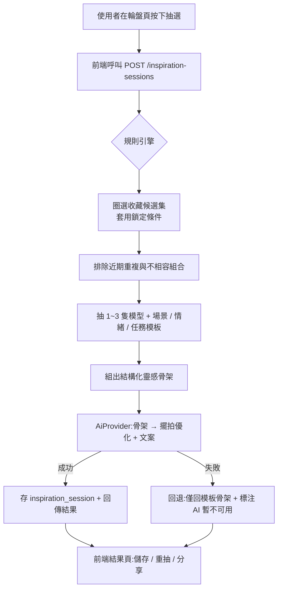

# 系統架構總覽

> 圖是流程的 single source of truth:改架構先改本檔的圖,再改 code。

## 系統架構圖

```mermaid
flowchart LR
    subgraph Client
        U[使用者瀏覽器 / 手機]
    end
    subgraph Frontend["Nuxt 3(Vercel,暫定)"]
        FE[SSR 頁面 + OG meta<br/>i18n en / zh-TW]
    end
    subgraph Backend["Spring Boot(Render,暫定)"]
        API[REST API /api/v1]
        SVC[Domain Services<br/>figure / inspiration / user]
        RULE[規則引擎<br/>選片・搭配・去重]
        AI[AiProvider Adapter]
        ST[StorageService]
    end
    DB[(PostgreSQL<br/>Neon,暫定)]
    CL[Claude API]
    FS[/本機 uploads → R2(未來)/]

    U --> FE
    FE -->|"fetch(NUXT_PUBLIC_API_BASE)"| API
    API --> SVC
    SVC --> RULE
    SVC --> DB
    RULE --> AI
    AI -->|"ANTHROPIC_API_KEY(僅後端)"| CL
    SVC --> ST --> FS
```

要點:前端永不直連 AI;規則引擎負責候選篩選與搭配可行性(spec 20D),AI 只把結構化結果寫成自然語言。

## 核心流程:靈感輪盤生成(MVP 主流程)



## 分層邊界

| 層 | 職責 | 禁止 |
|---|---|---|
| Nuxt pages/features | 畫面與互動,經 services 呼叫 API | 商業邏輯、直連 AI |
| api/v1(Controller) | request 驗證、呼叫 service、回 DTO | 商業邏輯、回傳 Entity |
| domain services | 業務邏輯、交易邊界、規則引擎 | HTTP 細節 |
| ai/ | Provider 抽象與實作 | 業務判斷 |
| storage/ | 檔案存取抽象 | 業務判斷 |

前端細節見 frontend-architecture.md;後端細節見 backend-architecture.md;資料表見 data-model.md。
