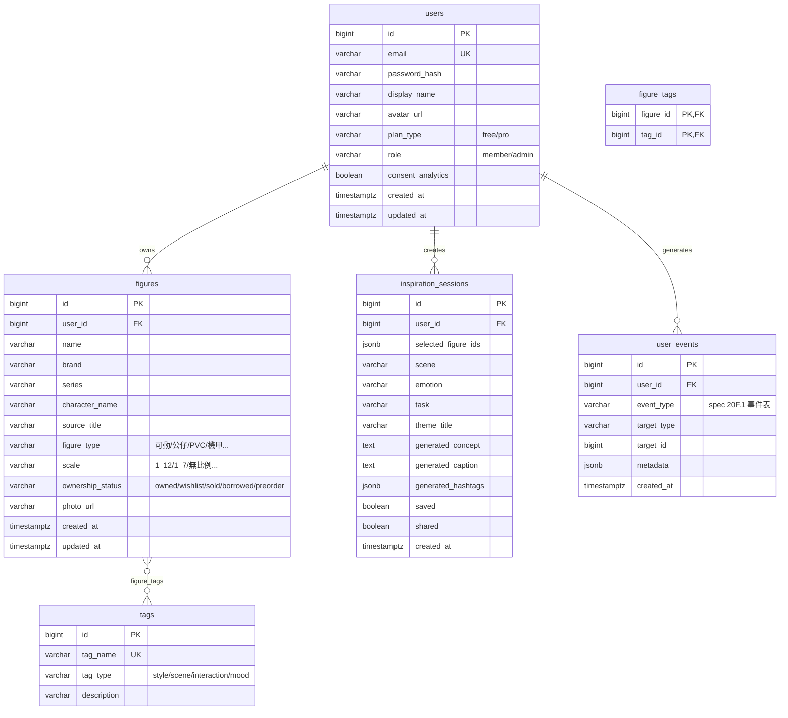

# Data Model(MVP:spec 第 11 節簡化 schema)

> Flyway 管理(backend/src/main/resources/db/migration/)。改表先改本檔 erDiagram 與說明,再寫 migration。
> spec 20C 的 27 表正規化(公共模型主檔、variants、審核)是資料量起來後的方向,MVP 不做。

## ERD

## 設計備註

- 標籤走 `tags` + `figure_tags` 關聯表(style/scene/interaction/mood 用 tag_type 區分),不用陣列欄位——對齊 spec 9 節標籤系統,查詢與統計(Phase 5)才做得動。
- `inspiration_sessions.selected_figure_ids` 用 jsonb 存抽選快照(模型可能被刪,快照保完整性)。
- `user_events.event_type` 對齊 spec 20F.1 事件清單(figure_created、wheel_completed、inspiration_saved…)。
- 個資與 Consent:`consent_analytics` 預設 false;刪帳號需級聯清除(spec 14 節),migration 已設 ON DELETE CASCADE。

## Migration 策略

- 一個變更一個 `V<n>__<desc>.sql`,不改已套用的檔。
- 本機/測試/正式一律 Flyway,`ddl-auto=validate`;seed 資料與 schema migration 分開(seed 走 `R__` repeatable 或獨立腳本)。
