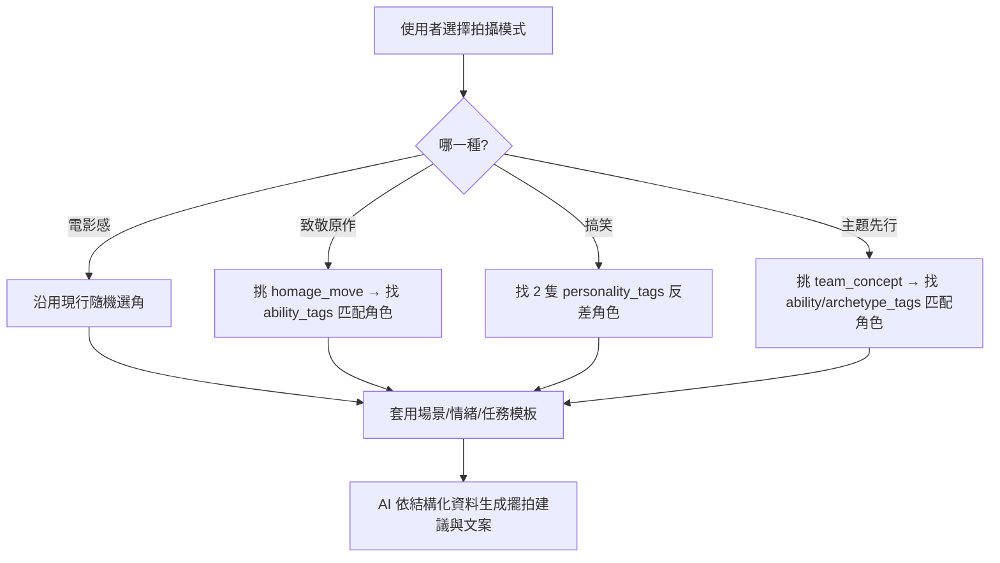

# 靈感模板 v2:多維度拍攝類型(PRE-006 延伸)

> 2026-07-12 擁有者提出構想,經 WebSearch 驗證真實參考後定稿。狀態:討論中(不阻擋現行進度,不變更現行 MVP 選角邏輯)。
> 定位:這是 [inspiration-templates.md](inspiration-templates.md)(150 組場景/情緒/任務/命名模板)的**選角與組合邏輯層**——決定「該怎麼選人、為什麼選這幾個」,底層素材庫仍共用。

## 定位澄清(我的分析,供討論)

四種類型性質不完全對等:

- **電影感(Cinematic)**:是**視覺風格層**——套在任何選角結果之上都成立(打光、構圖、色調偏好)。跟現有 `demoStyles` 的 `cinematic` 選項其實是同一件事。
- **致敬原作 / 搞笑 / 主題先行選角**:是**選角邏輯層**——決定「系統怎麼從收藏池挑出這幾隻」,挑完才套用場景/情緒/任務。

為了 UX 一致(使用者面前是「四個模式選一個」的選單),仍建議做成 4 個平行選項,只是後端邏輯分兩類。

## 資料模型擴充需求(新增 3 個標籤維度)

現有 `style_tags`/`scene_tags` 不夠支撐這套邏輯,需要新增(僅記錄需求,不在本次實作,待 P0 figures schema 定案時一併規劃):

| 維度 | 說明 | 範例值 |
|---|---|---|
| `ability_tags` | 能力/動作特徵,呼應 [ADR-0005](../adr/0005-image-sourcing-ai-input-policy.md) 附帶的 `movement_traits` schema | `aerial_traversal`(擺盪/滑翔)、`tendril_based`(鞭/觸手)、`super_strength`、`stealth`、`magic`、`flight`、`speed`、`melee_weapon`、`energy_projection`、`shapeshifting` |
| `personality_tags` | 性格特徵,驅動搞笑模式的碰撞邏輯 | `deadpan`、`hotheaded`、`naive`、`arrogant`、`chaotic`、`stoic`、`shy`、`disciplined` |
| `archetype_tags` | 角色原型/敘事定位,驅動主題先行選角 | `femme_fatale_spy`、`mentor`、`rookie`、`trickster`、`rival`、`leader`、`strategist` |

## Mode 1:電影感(Cinematic)

**選角邏輯**:沿用現行 MVP 隨機選角(不變)。
**模板偏向**:優先抽取 `inspiration-templates.md` 中光線感強的場景(頂樓、廢墟、車站大廳、攝影棚)+ 史詩/寂寞/懷舊系情緒。
**命名語感**:寬幅運鏡感的句子(現有命名模板庫多數已符合,不需新建)。

## Mode 2:致敬原作(Homage)

**核心概念**:重現角色出典作品中的招牌畫面/姿勢,**不要求同版本模型,允許跨角色**——只要動作/能力對得上,誰來演都算致敬。真實參照:漫畫業界的 **Homage Cover** 傳統(如 DC 曾讓 Batgirl 封面致敬電影《紫雨》海報、Catwoman 封面致敬《007》海報——本來就是跨媒介、跨角色的致敬玩法),以及 IG 模型攝影師 [@hotkenobi](https://mymodernmet.com/hotkenobi-action-figure-photography/) 實際在做的跨宇宙惡搞重現。

**選角邏輯**:從 `homage_moves` 庫挑一個招牌動作模板 → 找出 `ability_tags` 對得上的模型(可以是本尊,也可以是別的角色)→ 命名時標注「致敬 XX 招牌動作」而非「扮演 XX」。

**`homage_moves` 庫(初版 12 組,示範用)**:

| # | 招牌動作 | 需要的 ability_tags | 說明 |
|---|---|---|---|
| H01 | 擺盪橫越天際線 | `aerial_traversal` / `tendril_based` | 蜘蛛人式擺盪;鞭/觸手系角色皆可致敬 |
| H02 | 招牌能量亮相起手式 | `energy_projection` / `magic` | 能量爆發/法陣詠唱前的定格瞬間 |
| H03 | 拔刃對峙 | `melee_weapon` | 武士/劍士類的緊張對峙鏡頭 |
| H04 | 貫地衝擊波拳 | `super_strength` | 落地重擊、地面碎裂的力量系瞬間 |
| H05 | 振翅定格 | `flight` | 飛行角色展翼瞬間,適合仰角 |
| H06 | 刺殺前的隱匿凝視 | `stealth` | 暗殺/潛行角色出手前一刻 |
| H07 | 變身特寫 | `shapeshifting` | 變身過程的戲劇性特寫 |
| H08 | 團隊背靠背站位 | 任意 2+ 角色 | 經典團隊海報站位,不限定能力 |
| H09 | 反派制高點俯瞰 | `archetype_tags: villain` | 反派角色的居高臨下鏡頭 |
| H10 | 傷痕累累仍屹立 | 不限 | 戰損感的堅持瞬間,任何角色皆可 |
| H11 | 都市剪影對峙 | 2 角色 | 天際線背光下的兩人對峙 |
| H12 | 招牌台詞手勢 | 不限 | 角色標誌性手勢(比如指向前方) |

## Mode 3:搞笑(Comedic)

**核心概念**:靠**性格碰撞**製造笑點,不是靠場景荒謬。真實參照:[Odd Couple](https://tvtropes.org/pmwiki/pmwiki.php/Main/OddCouple)(一板一眼 vs 邋遢隨性)、子分類 **Red Oni Blue Oni**(一急一穩)、**Opposites Attract**——這些都是喜劇界成熟的角色配對公式。

**選角邏輯**:從池中挑 2 隻 `personality_tags` **互斥或反差大**的角色配對(如 `hotheaded` × `deadpan`、`chaotic` × `disciplined`)。
**模板偏向**:優先抽取現有 `inspiration-templates.md` 的 daily/social 任務類(等外送、排隊、開會)+ 冷面幽默/尷尬/荒謬情緒——這部分素材庫已經夠用,不需新建,只是挑選邏輯改成「反差優先」而非隨機。

## Mode 4:主題先行選角(Theme-first)

**核心概念**:反轉現行流程——**先定主題,再從池中找符合的角色**,而不是先抽角色再想主題。真實參照:TVTropes 的 [Power Trio](https://tvtropes.org/pmwiki/pmwiki.php/Main/PowerTrio)(力量/智慧/速度三人組是最經典的變體)與 [Five-Man Band](https://tvtropes.org/pmwiki/pmwiki.php/Main/FiveManBand)(領袖/副手/智將/肌肉/心臟五人分工)、[Femme Fatale Spy](https://tvtropes.org/pmwiki/pmwiki.php/Main/FemmeFataleSpy)(黑寡婦被列為經典範例,直接驗證你的「女特務三人組」發想)。

**兩種子模式**:
1. **能力型**(ability_tags 相同/相關即成團,你的「擺盪小隊」範例)
2. **原型型**(archetype_tags 匹配某個 trope,你的「女特務三人組」範例)

**`team_concepts` 庫(初版 9 組,示範用)**:

| # | 主題 | 類型 | 需求 | 說明 |
|---|---|---|---|---|
| T01 | 擺盪小隊(Swinging Team) | 能力型 | 2~3 隻 `aerial_traversal`/`tendril_based` | 擁有者原始範例:出久黑鞭 + 蜘蛛人 |
| T02 | 破壞力量隊 | 能力型 | 3 隻 `super_strength` | Power Trio 的力量變體 |
| T03 | 隱匿三人組 | 能力型 | 3 隻 `stealth` | 潛行角色集結 |
| T04 | 魔法使聯盟 | 能力型 | 2~4 隻 `magic` | 法師/咒術系集合 |
| T05 | 飛行編隊 | 能力型 | 2~3 隻 `flight` | 飛行角色編隊 |
| T06 | 蛇蠍美人特務組 | 原型型 | 3 隻 `femme_fatale_spy` | 擁有者原始範例:Black Cat / Catwoman / Black Widow / Yor Forger |
| T07 | 力量智慧速度三人組 | 原型型 | 3 隻,分別 `strength`/`strategist`/`speed` | 經典 Power Trio 三角色分工 |
| T08 | 反差萌搭檔 | 原型型 | 2 隻,`personality_tags` 對立 | 與 Mode 3(搞笑)共用邏輯,可互相導流 |
| T09 | 導師與新秀 | 原型型 | 2 隻,`mentor` + `rookie` | 師徒/傳承敘事 |

## 整體選角流程

## 待研究補完

- `homage_moves` 與 `team_concepts` 目前各僅 12/9 組示範,量還不夠,待擁有者篩選方向後擴充。
- 角色的 `ability_tags`/`personality_tags`/`archetype_tags` 需要在種子資料(PRE-005)階段就一併標註,建議擁有者整理收藏清單時比照這三個維度順手標記。
- Mode 4 的 Five-Man Band(五人分工)複雜度較高,建議列為進階版本,先從 Power Trio(三人)量產驗證。

## Sources

- [Power Trio - TV Tropes](https://tvtropes.org/pmwiki/pmwiki.php/Main/PowerTrio)
- [Five-Man Band - TV Tropes](https://tvtropes.org/pmwiki/pmwiki.php/Main/FiveManBand)
- [Femme Fatale Spy - TV Tropes](https://tvtropes.org/pmwiki/pmwiki.php/Main/FemmeFataleSpy)
- [Odd Couple - TV Tropes](https://tvtropes.org/pmwiki/pmwiki.php/Main/OddCouple)
- [10 DC Comics Variant Covers That Pay Homage To Movie Posters - CBR](https://www.cbr.com/dc-comics-variant-covers-similar-movie-posters/)
- [Action Figure Photography Imagines the Alternate Lives of Superheroes(@hotkenobi)- My Modern Met](https://mymodernmet.com/hotkenobi-action-figure-photography/)
- [54 Cinematic Action Figure Photos That Recreate Movie Scenes - Bored Panda](https://www.boredpanda.com/movie-tv-mashups-action-figure-photography-killcutter/)
