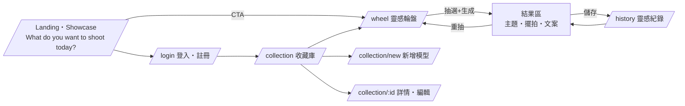

# UI Flow(MVP 頁面與導線)

> Low-fi wireframe 屬 PRE-008(未開始);本檔先定頁面清單與導線,wireframe 定稿後回填修正。

## 頁面清單(現況 = placeholder)

| 路由 | 內容 | 狀態 |
|---|---|---|
| `/` | Showcase + 核心提問 + CTA;SSR + OG meta | placeholder ✓ |
| `/login` | 登入/註冊(empty layout) | placeholder ✓ |
| `/collection` | 收藏 grid + 篩選 + 新增入口 | placeholder ✓ |
| `/wheel` | 選數量/鎖定 → 抽選動畫 → 結果 | placeholder ✓ |
| `/history` | 已儲存靈感列表 | placeholder ✓ |

## 導線原則

- 訪客可看 Landing 與試玩輪盤(結果不入庫),要儲存才要求登入(降低啟用門檻,對齊 spec 20J Activation)。
- 任何頁面 ≤2 步可回到輪盤(核心動作)。
