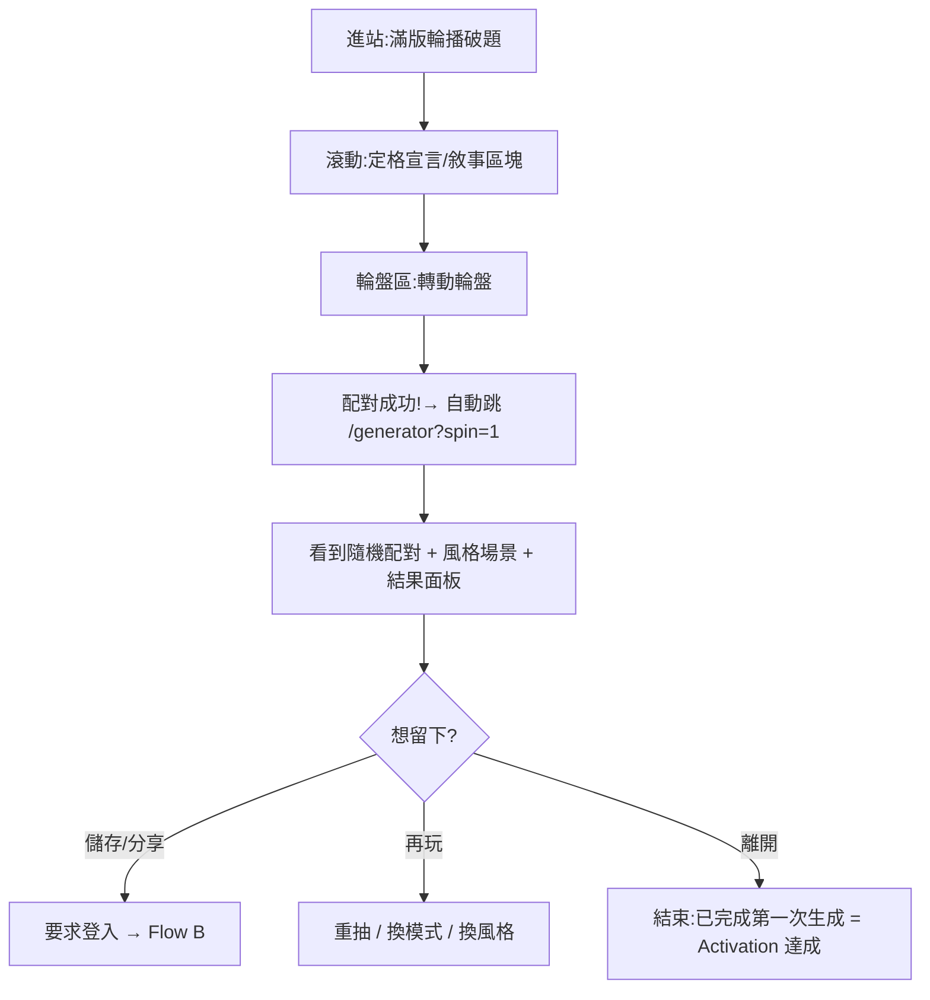

# User Flow(PRE-007)

> 初稿 2026-07-12,依已實作的前端五頁繪製;圖為流程正本(改流程先改圖)。狀態:暫定,待擁有者審。
> 頁面級導線見 ui-flow.md;本檔是「使用者任務」層級的五條流程。

## Flow A:訪客首次體驗(已實作,Activation 主路徑)



## Flow B:註冊 / 登入(P1,頁面已備)

```mermaid
flowchart TD
    A[任一受保護動作:儲存/分享/收藏] --> B[/login]
    B --> C{有帳號?}
    C -->|有| D[email + 密碼登入]
    C -->|無| E[註冊:email + 密碼 + 暱稱]
    E --> F[同意條款 + Consent 選項<br/>分析追蹤預設關閉]
    D --> G[回到原頁並完成原動作]
    F --> G
```

## Flow C:新增收藏(頁面已備,API 待接)

```mermaid
flowchart TD
    A[/collection] --> B{有收藏?}
    B -->|無| C[空狀態:新增第一隻模型 CTA]
    B -->|有| D[卡片牆:搜尋 / 狀態篩選]
    C --> E[/collection/new 表單]
    D -->|＋ 新增模型| E
    E --> F[填名稱(必填)+ 廠牌/系列/類型/比例/狀態/標籤]
    F --> G[上傳照片(可跳過)]
    G --> H[儲存 → 回列表,新卡片高亮]
    D -->|點卡片| I[詳情 Sheet:編輯 / 帶進產生器]
```

## Flow D:產生靈感(已實作)

```mermaid
flowchart TD
    A[/generator] --> B[選模式:配對 / 小隊 / 跨作品]
    B --> C[點角色入欄位<br/>再點取消;可鎖定]
    C --> D[選風格與場景(可跳過)]
    D --> E{Generate}
    E --> F[結果面板滑入:主題 + 擺拍建議 + 文案]
    F -->|不滿意| G[重抽:未鎖定欄位重擲]
    G --> F
    F -->|滿意| H[儲存(登入)/ 分享 / 複製文案]
```

## Flow E:儲存與分享回流(分享頁已備)

```mermaid
flowchart TD
    A[結果面板:儲存] --> B[/history 靈感紀錄]
    B --> C[點紀錄 → 重看 / 分享]
    C --> D[/share/:id 分享頁(SSR + OG)]
    D --> E[貼到 IG / Threads / X]
    E --> F[訪客點連結進分享頁]
    F --> G[CTA:我也要創作 → Flow A 的 D]
```

## 待決(擁有者審時定)

1. 訪客生成結果是否允許「免登入暫存一筆」(降低流失)?
2. Flow C 照片上傳是否 MVP 必要,或先純文字收藏?
3. 分享頁是否顯示創作者名稱(需帳號公開設定)?
