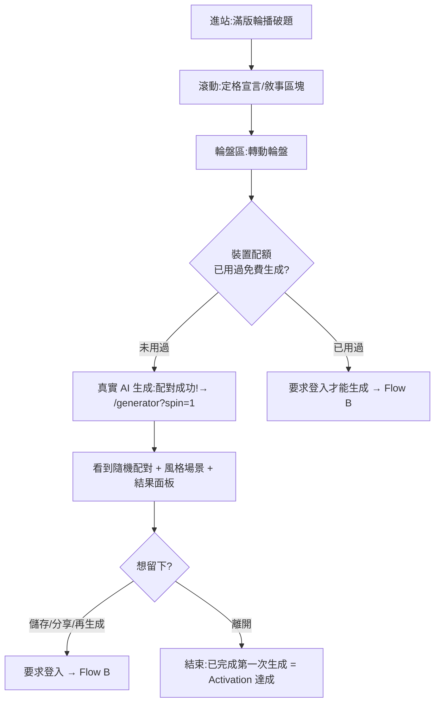

# User Flow(PRE-007)

> 初稿 2026-07-12,依已實作的前端五頁繪製;圖為流程正本(改流程先改圖)。狀態:暫定,待擁有者審。
> 頁面級導線見 ui-flow.md;本檔是「使用者任務」層級的五條流程。

## Flow A:訪客首次體驗(已實作,Activation 主路徑)



> 訪客配額:裝置以簽章 cookie 追蹤,**每裝置 1 次免費真實生成**(非假 demo,展示真實成果建立信任);用完後結果仍可查看/複製文案,但再生成/儲存/分享一律要求登入。後端同步記錄 IP+裝置指紋於 `ai_usage_logs` 偵測異常;超標追加驗證碼。詳見 security-guideline.md 防濫用章節。

## Flow B:註冊 / 登入(P1,頁面已備)

```mermaid
flowchart TD
    A[任一受保護動作:儲存/分享/收藏] --> B[/login]
    B --> C{有帳號?}
    C -->|有| D[email + 密碼登入]
    C -->|無| E[註冊:email + 密碼 + 暱稱]
    E --> F[同意條款 + Consent 選項<br/>分析追蹤預設關閉]
    D --> G[回到原頁並完成原動作]
    F --> G
```

## Flow C:新增收藏(頁面已備,API 待接)

```mermaid
flowchart TD
    A[/collection] --> B{有收藏?}
    B -->|無| C[空狀態:新增第一隻模型 CTA]
    B -->|有| D[卡片牆:搜尋 / 狀態篩選]
    C --> E[/collection/new 表單]
    D -->|＋ 新增模型| E
    E --> F[填名稱(必填)+ 廠牌/系列/類型/比例/狀態/標籤<br/>series/character_name/tags 至少一項,否則 FIG_003]
    F --> G{要上傳照片?}
    G -->|跳過| H[儲存 → 回列表,新卡片高亮]
    G -->|上傳| G2[勾選同意聲明<br/>inline checkbox,非獨立頁面]
    G2 --> H
    D -->|點卡片| I[詳情 Sheet:編輯 / 帶進產生器]
```

> 照片同意聲明是**表單內的一個勾選項**,跟著上傳欄位一起出現,不是獨立問卷頁——只有選擇上傳照片時才要求勾選,未勾選不可送出(`FIG_004`)。文案與規則見 ADR-0005 / security-guideline.md。

## Flow D:產生靈感(已實作)

```mermaid
flowchart TD
    A[/generator] --> B[選模式:配對 / 小隊 / 跨作品]
    B --> C[點角色入欄位<br/>再點取消;可鎖定]
    C --> D[選風格與場景(可跳過)]
    D --> E{Generate}
    E --> F[結果面板滑入:主題 + 擺拍建議 + 文案]
    F -->|不滿意| G[重抽:未鎖定欄位重擲]
    G --> F
    F -->|滿意| H[儲存(登入)/ 分享 / 複製文案]
```

## Flow E:儲存與分享回流(分享頁已備)

```mermaid
flowchart TD
    A[結果面板:儲存] --> B[/history 靈感紀錄]
    B --> C[點紀錄 → 重看 / 分享]
    C --> D[/share/:id 分享頁(SSR + OG)]
    D --> E[貼到 IG / Threads / X]
    E --> F[訪客點連結進分享頁]
    F --> G[CTA:我也要創作 → Flow A 的 D]
```

## 決策紀錄(2026-07-12 擁有者拍板)

| # | 決策 | 理由 |
|---|---|---|
| 1 | 訪客免登入可生成,但**限每裝置 1 次真實 AI 呼叫**(cookie 配額 + 後端異常偵測) | 平衡「展示真實成果建立信任」與「AI 呼叫即成本,不可無限開放」(擁有者提出商業化後的成本曝險疑慮) |
| 2 | 照片維持**選填**;改要求「系列/角色名/標籤三者至少填一」 | v1 AI(ADR-0003 純文字)不讀圖片,靠結構化欄位辨識模型;照片對 AI 配對無幫助,真正該顧的是文字識別資訊完整度 |
| 3 | 分享頁**預設顯示** display name(不含 email) | MVP 先簡化處理,非敏感個資風險低;匿名選項留待個人設定頁後補 |
